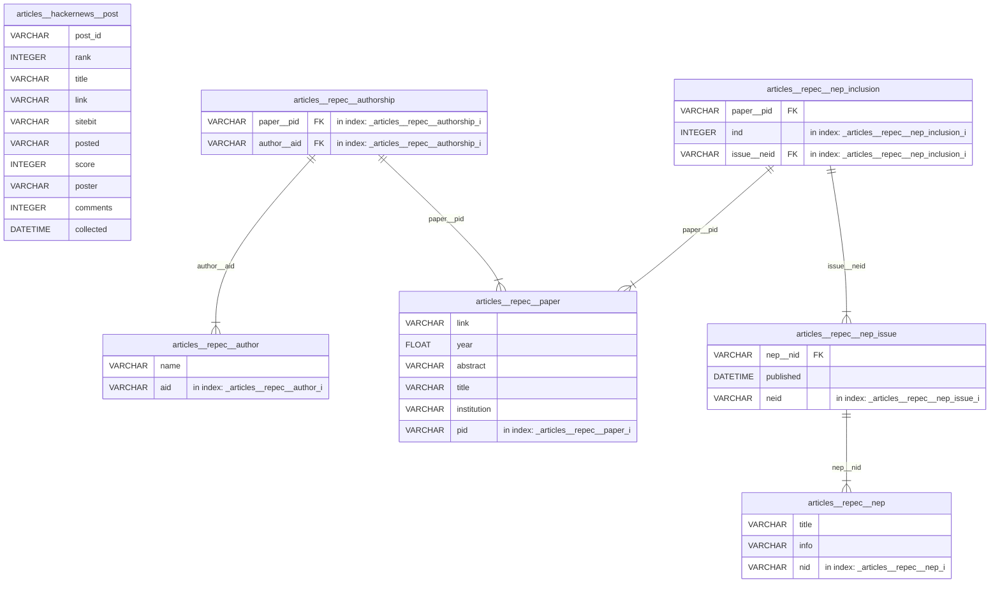

```mermaid
erDiagram
  articles__hackernews__post {    
    VARCHAR post_id      
    INTEGER rank      
    VARCHAR title      
    VARCHAR link      
    VARCHAR sitebit      
    VARCHAR posted      
    INTEGER score      
    VARCHAR poster      
    INTEGER comments      
    DATETIME collected  
  }
  articles__repec__author {    
    VARCHAR name      
    VARCHAR aid  "in index: _articles__repec__author_i"
  }
  articles__repec__authorship {    
    VARCHAR paper__pid FK "in index: _articles__repec__authorship_i"    
    VARCHAR author__aid FK "in index: _articles__repec__authorship_i"
  }
  articles__repec__paper {    
    VARCHAR link      
    FLOAT year      
    VARCHAR abstract      
    VARCHAR title      
    VARCHAR institution      
    VARCHAR pid  "in index: _articles__repec__paper_i"
  }
  articles__repec__nep {    
    VARCHAR title      
    VARCHAR info      
    VARCHAR nid  "in index: _articles__repec__nep_i"
  }
  articles__repec__nep_inclusion {    
    VARCHAR paper__pid FK     
    INTEGER ind  "in index: _articles__repec__nep_inclusion_i"    
    VARCHAR issue__neid FK "in index: _articles__repec__nep_inclusion_i"
  }
  articles__repec__nep_issue {    
    VARCHAR nep__nid FK     
    DATETIME published      
    VARCHAR neid  "in index: _articles__repec__nep_issue_i"
  }
  articles__repec__authorship ||--|{ articles__repec__paper : "paper__pid"
  articles__repec__authorship ||--|{ articles__repec__author : "author__aid"
  articles__repec__nep_inclusion ||--|{ articles__repec__paper : "paper__pid"
  articles__repec__nep_inclusion ||--|{ articles__repec__nep_issue : "issue__neid"
  articles__repec__nep_issue ||--|{ articles__repec__nep : "nep__nid"
```

